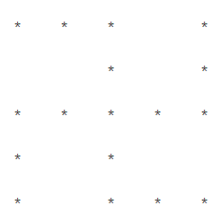

 # Patterns Problems
*** 
### Some patterns problem to understand loops and conditional statements. 
---
 ## Pattern 1
 * ### * 
 * ### *    *  
 * ### *    *   *
 * ### *    *   *   * 
 * ### *    *   *   *   *
---
 ## Pattern 2
 * ### *    *   *   *   *
 * ### *    *   *   *
 * ### *    *   *
 * ### *    *
 * ### *
---
 ## Pattern3
 * ###  --------*
 * ###  ------* *
 * ###  ----* * *
 * ###  --* * * *
 * ###  * * * * *
---
 ## Pattern4
 * ### * * * * *
 * ### --* * * * 
 * ### ----* * * 
 * ### ------* *
 * ### --------*
---
 ## Pattern5
 * ### ----*
 * ### --* * *
 * ### * * * * *
 * ### --* * *
 * ### ----*
---
## Pattern 6
* ### * * * *----* * * *
* ### * * *--------* * *
* ### * *------------* *
* ### * * *--------* * *
* ### * * * *----* * * *
---
## Pattern 7
* ### *
* ### --*
* ### ----*
* ### ------*
* ### --------*
---
## Pattern 8
* ### --------*
* ### ------*
* ### ----*
* ### --*
* ### *
---
## Pattern 9
* ### * *-------* *
* ### --* *---* *
* ### ----*
* ### --* *--* *
* ### * *------* *
---
## Pattern10
 * ### -----*
 * ### --* *---* *
 * ### * *-------* *
 * ### --* *----* *
 * ### -----*
---
 ## Pattern11
 * ### 1
 * ### 2 3
 * ### 4 5 6
 * ### 7 8 9 10
 * ### 11 12 13 14 15
---
## Pattern12
* ### 0	
* ### 1	1	
* ### 2	3	5	
* ### 8	13	21	34	
* ### 55	89	144	233	377	
---
## Pattern13
* ### 1	
* ### 1	 1	
* ### 1	 2	1	
* ### 1	 3	3	1	
* ### 1	 4	6	4	1	
---
## Pattern14
* ### 3 * 1 = 3
* ### 3 * 2 = 6
* ### 3 * 3 = 9
* ### 3 * 4 = 12
* ### 3 * 5 = 15
* ### 3 * 6 = 18
* ### 3 * 7 = 21
* ### 3 * 8 = 24
* ### 3 * 9 = 27
* ### 3 * 10 = 30
---
## Pattern15
* ### 1-----------1
* ### 12--------21
* ### 123-----321
* ### 1234--4321
* ### 1234554321
---
## Pattern16
* ### 1 2 3 4 5
* ### 11 12 13 14 15
* ### 21 22 23 24 25
* ### 16 17 18 19 20
* ### 6 7 8 9 10
---
## Pattern17
* ### E
* ### DE
* ### CDE
* ### BCDE
* ### ABCDE
---
## Pattern18
* ###-----1
* ###----232
* ###---34543
* ###--4567654
* ###-567898765
---
## Pattern19
* ### 5 5 5 5 5 5 5 5 5 
* ### 5 4 4 4 4 4 4 4 5 
* ### 5 4 3 3 3 3 3 4 5 
* ### 5 4 3 2 2 2 3 4 5 
* ### 5 4 3 2 1 2 3 4 5 
* ### 5 4 3 2 2 2 3 4 5 
* ### 5 4 3 3 3 3 3 4 5 
* ### 5 4 4 4 4 4 4 4 5 
* ### 5 5 5 5 5 5 5 5 5 
---
## Pattern20
* ### ----1	
* ### --2 3 2	
* ### 3 4 5 4 3	
* ### --2 3 2	
* ### ----1	
---
## Pattern21
* ### 1-------------1	
* ### 12-----------21	
* ### 123---------321	
* ### 1234------4321	
* ### 12345----54321	
* ### 123456-654321	
* ### 1234567654321
---
## Pattern22
###### _Just ignore_ "--"
* ### --------- *
* ###  -------- * -- *
* ### * -- * -- * -- * -- * 
* ### --------- * -- *
* ### --------- *
---
## Pattern23
* ### * -- * -- * -- * -- * -- * -- *	
* ### ------*--------------- *	
* ### ---------* ------- *	
* ### ---------------*	
* ### -----------* -- * -- *	
* ### -----* -- * -- * -- * -- *	
* ### * -- * -- * -- * -- * -- * -- *	
---
## Pattern24

--- 
## Pattern25

*******